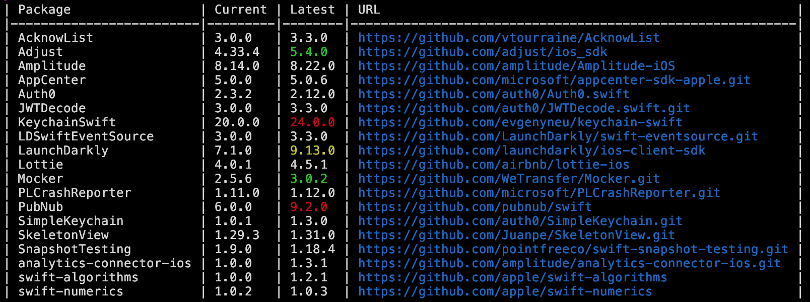

In the world of app development, time is never standing still. Even if your project doesn't change much, the world around it is constantly evolving. Not ony operating sytems and compilers change, but also libraries receive updates - sometimes even critical security updates - that should be
applied rather sooner than later to protect your customer's data.

Most projects depend on some third-party dependencies for example to simplify networking, to enable user tracking or just by incorporating [a beautiful
UI component](https://github.com/benrudhart/AppleEffortScorePicker) that doesn't need to be written from scratch.

How can you keep track of all this?

Fortunately, for Swift Package Manager-based projects there is a tool called [swift-outdated](https://github.com/kiliankoe/swift-outdated) that can assist you.

Install it via [homebrew](https://brew.sh):

```bash
brew install swift-outdated
```

In your project directory, run it as follows to check your dependencies:

```bash
swift-outdated
```

This will show you a table such as this



and list all your outdated dependencies, the currently resolved version and the latest version available in their upstream repository.

The color code of the version number gives you an idea how old the dependency is:

| color| dependency "age"|
|-------| -- |
| white | current (it can still differ in minor or patch versions, though) |
| green | one major version behind |
| yellow | two major versions behind |
| red | more than 3 major versions behind |

It's good practice to check outdated dependencies from time to time by clicking their link, going through their changesets and update them.
